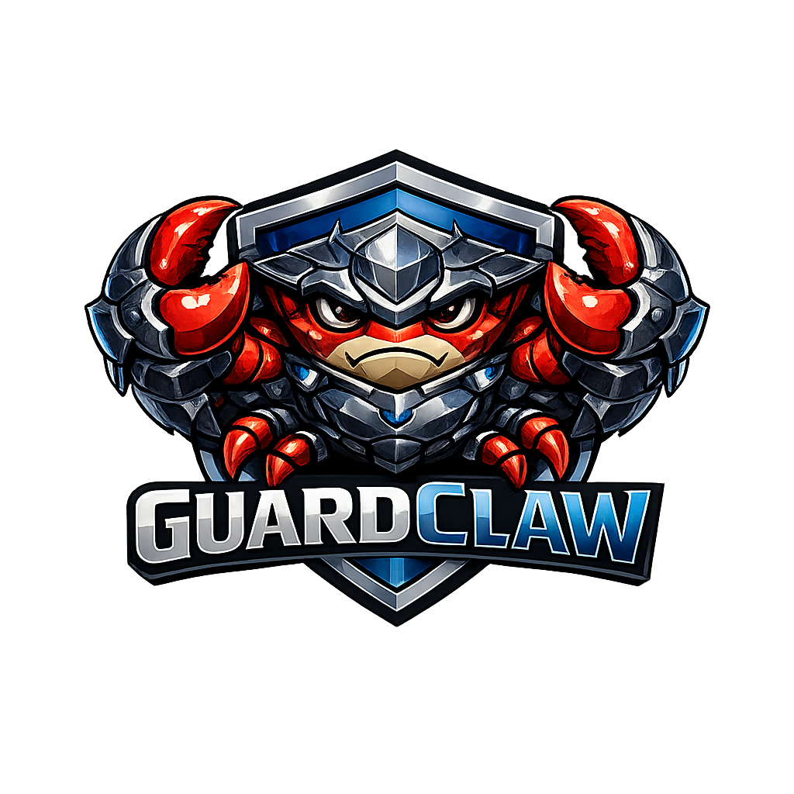

<div align="center">



<h1>GuardClaw</h1>

<p>
  A consent-based household safety coordinator.<br>
  Ingests public safety alerts, reasons about who is affected, and dispatches calm, targeted family notifications across Telegram, Discord, and Email.
</p>

[](LICENSE)

</div>

---

## Table of Contents

- [About](#about)
- [Built With](#built-with)
- [Getting Started](#getting-started)
  - [Demo Frontend (Fastest — No Backend Required)](#demo-frontend-fastest--no-backend-required)
  - [Full Stack (Backend + Frontend)](#full-stack-backend--frontend)
  - [Mobile App](#mobile-app)
  - [Docker Compose](#docker-compose)
- [Usage](#usage)
  - [Trigger a Demo Alert](#trigger-a-demo-alert)
  - [Cal Poly IPAWS Script](#cal-poly-ipaws-script)
  - [API Reference](#api-reference)
- [Hermes Integration](#hermes-integration)
- [Roadmap / What Remains Stubbed](#roadmap--what-remains-stubbed)
- [License](#license)

---

## About


GuardClaw is a hackathon MVP that demonstrates agentic household safety coordination. When a public safety alert arrives, GuardClaw:

1. **Ingests** the alert from IPAWS CAP, USGS, NWS, or a replay fixture
2. **Reasons** about household context — who is home, who is away, upcoming calendar events, occupancy signals
3. **Classifies** severity (`minor` → `life_threatening`) via Hermes AI or deterministic fallback
4. **Routes** notifications to the right people on the right channels (Telegram, Discord, Email, SMS)
5. **Logs** every action to an auditable timeline with human-readable rationale

Demo mode is explicit throughout — all outbound sends are stubbed and timeline-logged unless Hermes is configured.

---

## Built With

| Layer | Stack |
|---|---|
| Backend | Python · FastAPI · Pydantic · SQLite |
| Web Dashboard | Next.js · TypeScript · Tailwind CSS · Leaflet |
| Mobile | Expo · React Native · Supabase Realtime |
| AI Backbone | [Hermes Agent](https://github.com/NousResearch/hermes-agent) · GitHub Copilot (`gpt-5-mini`) |
| Realtime / DB | Supabase (optional) |
| Infrastructure | Docker Compose · Cloudflare Tunnels (optional) · Vercel |

---

## Getting Started

### Demo Frontend (Fastest — No Backend Required)

`demo-frontend/` is a standalone Next.js app using fixture data. No backend, Hermes, or Supabase needed.

```bash
cd demo-frontend
npm install
NEXT_PUBLIC_FRONTEND_ONLY=true npm run dev
```

Open `http://localhost:3000`.

> The app is also deployed to Vercel for judges who prefer not to run anything locally.

---

### Full Stack (Backend + Frontend)

**Prerequisites:** Python 3.11+, Node.js 18+

**1. Backend**

```bash
cd backend
python -m venv .venv
. .venv/bin/activate
pip install -r requirements.txt
uvicorn app.main:app --reload
```

Runs at `http://localhost:8000`.

**2. Frontend**

```bash
cd frontend
npm install
npm run dev
```

Runs at `http://localhost:3000`. If that port is occupied:

```bash
npm run dev -- --hostname 127.0.0.1 --port 3200
```

**3. (Optional) Hermes AI backbone**

See [`hermes/README.md`](hermes/README.md) for the full setup guide. If Hermes is not running, GuardClaw falls back to deterministic local classification and message drafts automatically.

---

### Mobile App

```bash
cd mobile
npm install
cp .env.example .env   # fill in Supabase credentials, or leave blank for demo mode
npx expo start
```

> **Cal Poly wifi:** The campus network blocks Expo's LAN port. Use `--tunnel` instead:
> ```bash
> npx expo start --tunnel
> # First time only: npx expo install @expo/ngrok
> ```

The app runs with polished fixture data if Supabase env vars are empty.

**Supabase setup (optional):** Create a project, run `scripts/supabase-guardclaw-demo.sql` in the SQL editor, then copy the project URL and keys into `backend/.env` and `mobile/.env`.

Fixed demo family IDs:
- Family: `00000000-0000-4000-8000-000000000001`
- Alex Rivera: `00000000-0000-4000-8000-000000000101`
- Jordan Lee: `00000000-0000-4000-8000-000000000102`
- Maya Rivera: `00000000-0000-4000-8000-000000000103`

**TestFlight:**
```bash
cd mobile && npx eas login && npx eas build --platform ios && npx eas submit --platform ios
```

---

### Docker Compose

```bash
docker compose up --build
```

Open `http://localhost:3000`.

---

## Usage

### Trigger a Demo Alert

With the backend running:

```bash
# Default replay
curl -X POST http://localhost:8000/api/simulate/event \
  -H "Content-Type: application/json" -d '{}'

# IPAWS replay
curl -X POST http://localhost:8000/api/simulate/event \
  -H "Content-Type: application/json" -d '{"source":"ipaws"}'
```

Inspect state:

```bash
curl http://localhost:8000/api/incidents/active
curl http://localhost:8000/api/household
curl http://localhost:8000/api/actions/timeline
```

Acknowledge a timeline item:

```bash
curl -X POST http://localhost:8000/api/actions/acknowledge \
  -H "Content-Type: application/json" \
  -d '{"target_id":"<timeline-id>","acknowledged_by":"demo-guardian"}'
```

### Cal Poly IPAWS Script

Triggers a Cal Poly shelter-in-place IPAWS replay in one command:

```bash
bash scripts/demo-cal-poly-ipaws-alert.sh
# Override backend URL:
GUARDCLAW_API_BASE_URL=http://localhost:8000 bash scripts/demo-cal-poly-ipaws-alert.sh
```

### API Reference

| Method | Endpoint | Description |
|---|---|---|
| `POST` | `/api/simulate/event` | Trigger a simulated alert |
| `GET` | `/api/incidents/active` | Get the active incident and action plan |
| `GET` | `/api/household` | Get household state and members |
| `POST` | `/api/actions/acknowledge` | Acknowledge a timeline entry |
| `GET` | `/api/actions/timeline` | Get the full action timeline |

### Alert Severity Routing

| Level | Who gets notified |
|---|---|
| `life_threatening` | All household members |
| `major` | All guardians + directly affected members |
| `moderate` | Guardians / parents only |
| `minor` | Priority-1 guardian only |

---

## Hermes Integration

> Full setup guide: [`hermes/README.md`](hermes/README.md)

Hermes is the AI messaging backbone. It runs as a dedicated `guardclaw` profile with its own identity ([`hermes/SOUL.md`](hermes/SOUL.md)) and provides:

- **Multichannel delivery** — Telegram, Discord, and Email from a single gateway
- **OpenAI-compatible API server** (port 8642) — backend calls this to classify alerts and refine message drafts
- **Webhook listener** (port 8644) — receives structured alert payloads and dispatches family notifications
- **Supabase event logging** — every lifecycle event logged for full observability
- **Cloudflare Tunnels** (optional) — stable public URLs so the backend can reach Hermes from any machine

**Our setup:** WSL2 (Ubuntu 24.04), `gpt-5-mini` via GitHub Copilot, exposed at `api.guardclaw.app` and `webhook.guardclaw.app`.

```bash
bash scripts/setup-hermes-guardclaw.sh
hermes -p guardclaw gateway run
```

> If the `guardclaw` profile shares a Telegram bot token with your default profile, stop the default gateway first: `hermes gateway stop`

See [`hermes/README.md`](hermes/README.md) for the full guide: WSL2 setup, platform integrations, Cloudflare Tunnels, Supabase logging, webhook subscriptions, and troubleshooting.

---

## Roadmap / What Remains Stubbed

- [ ] Real Telegram/Discord/Email/SMS sends from the backend (currently stubbed; Telegram is handled by the Hermes `guardclaw` profile)
- [ ] Live IPAWS feed (OpenFEMA IPAWS archived alerts are available but must not be described as live; NWS is implemented as a best-effort adapter)
- [ ] SLO County and Cal Poly alert sources (currently replay/manual-ingest fixtures)
- [ ] Real camera integration (currently represented as a boolean occupancy signal and prerecorded CCTV clip metadata)
- [ ] Supabase location snapshots for backend movement inference (mobile can post these when env vars are configured)
- [ ] Production RLS policies for Supabase tables

---

## License

Distributed under the Apache 2.0 License. See [`LICENSE`](LICENSE) for details.

---

## Contact
Jonah Chan — [GitHub](https://github.com/p1an0guy) — [LinkedIn](https://www.linkedin.com/in/jonah-chan/)
Jeremiah Liao - [GitHub](https://github.com/jeremiahliao) - [LinkedIn](https://www.linkedin.com/in/jeremiahliao/)
Mason Lewis - [GitHub](https://github.com/masonclewis) - [LinkedIn](https://www.linkedin.com/in/masonclewis/)
Isaac Tsai - [GitHub](https://github.com/itsisaac19) - [LinkedIn](https://www.linkedin.com/in/isaac-m-tsai/)

